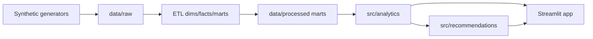

# Telecom Revenue & Customer Intelligence Platform

**A Python-Based Executive Decision Support Platform for Telecommunications Operators in Tanzania**

> **Disclaimer:** All data in this project is **synthetic**. This platform does not represent, imitate, or use confidential data from any real telecommunications operator. Version 1 excludes machine learning and external APIs.

---

## Executive Summary

This portfolio project simulates a Tanzanian telecom operator and turns synthetic operational data into executive-ready intelligence. It explains why revenue changes, where churn risk concentrates, which regions underperform, which campaigns work, and which products drive growth — always with **Finding → Business Impact → Recommendation**.

## Business Problem

The synthetic operator is growing subscribers, but revenue is growing more slowly than expected. Leadership needs to diagnose ARPU pressure, product mix shifts, churn, regional gaps, recharge behaviour, mobile money adoption, and campaign effectiveness.

## Platform Modules (Streamlit)

1. Executive Overview  
2. Subscriber Analytics  
3. Revenue Analytics  
4. Churn and Retention  
5. Recharge Analytics  
6. Mobile Money Analytics  
7. Campaign Analytics  
8. Regional Performance  
9. Executive Recommendations  

## Technology Stack

Python 3.11+ · Pandas · NumPy · PyArrow · Pydantic · Faker · Plotly · Streamlit · pytest · Ruff · mypy

- CSV for small reference data
- Parquet for large datasets and analytical marts

## Project Structure

```text
telecom-revenue-customer-intelligence/
├── app/                 # Streamlit UI (display only)
├── data/
│   ├── raw/             # Generated raw datasets (gitignored)
│   ├── processed/       # Marts/facts (large facts gitignored; slim marts committed)
│   ├── reference/       # Small reference datasets
│   └── exports/         # Optional extracts
├── docs/                # Business, architecture, performance, phases
├── scripts/             # CLI entry points
├── src/                 # Generation, ETL, analytics, recommendations
├── tests/
├── app.py
├── pyproject.toml
└── requirements.txt
```

## Development Profiles

| Profile | Subscribers | Period |
|---------|-------------|--------|
| `development` | 10,000 | Jan 2024 – Dec 2025 |
| `demo` | 25,000 | Jan 2024 – Dec 2025 |
| `portfolio` | 100,000 | Jan 2024 – Dec 2025 |

Default reporting month: **December 2025**.

## Current Status

**Version 1 complete (Phases 1–11):** full synthetic pipeline, ETL marts, analytics + recommendations, and the nine-module Streamlit dashboard.

## Local Setup

```bash
python3.11 -m venv .venv
source .venv/bin/activate   # Windows: .venv\Scripts\activate
pip install -r requirements.txt
pip install -e ".[dev]"     # optional: pytest, ruff, mypy
cp .env.example .env
```

## Generate Data (optional locally)

Committed slim marts under `data/processed/` are enough to launch the dashboard. To regenerate from scratch (`development`):

```bash
python -m scripts.generate_reference_data --profile development
python -m scripts.generate_customers --profile development
python -m scripts.generate_usage --profile development
python -m scripts.generate_recharges --profile development
python -m scripts.generate_mobile_money --profile development
python -m scripts.generate_campaigns --profile development
python -m scripts.generate_customer_events --profile development
python -m scripts.run_pipeline --profile development
python -m scripts.validate_data --profile development
```

See [`docs/performance.md`](docs/performance.md) for `demo` / `portfolio` notes.

## Health Check & Dashboard

```bash
python -m scripts.health_check --profile development
streamlit run app.py
```

## Quality Commands

```bash
ruff format .
ruff check .
pytest
mypy src
```

## Streamlit Community Cloud

1. Deploy from `main` with entry point `app.py`.
2. Prefer **Python 3.12** in Advanced settings (avoids package build issues on newer runtimes).
3. Slim dashboard marts are committed; large raw/fact files stay gitignored.

## Documentation Map

| Doc | Purpose |
|-----|---------|
| [`docs/architecture.md`](docs/architecture.md) | System architecture |
| [`docs/performance.md`](docs/performance.md) | Caching, profiles, regenerate commands |
| [`docs/kpi_dictionary.md`](docs/kpi_dictionary.md) | KPI definitions |
| [`docs/churn_methodology.md`](docs/churn_methodology.md) | Lifecycle / churn rules |
| [`docs/phases/`](docs/phases/README.md) | Phase delivery index |
| [`docs/assets/screenshots/`](docs/assets/screenshots/README.md) | Screenshot pack checklist |
| [`CHANGELOG.md`](CHANGELOG.md) | Version history |

## Architecture (high level)



Business logic stays in `src/`. `app/` only loads marts and renders results.
