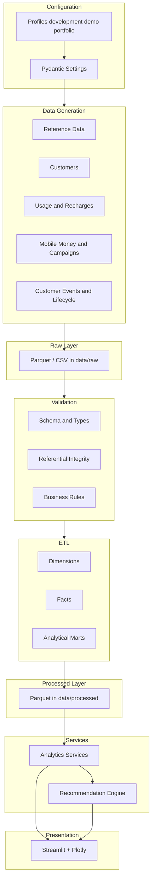

# Architecture

## Overview

The platform separates **data generation**, **validation**, **ETL**, **analytics**, **recommendations**, and **Streamlit presentation**. Business calculations live in `src/`. Streamlit pages load data, call services, and display charts and recommendations.

## Layer Responsibilities

| Layer | Responsibility | Location |
|-------|----------------|----------|
| Configuration | Profiles, seeds, paths, formats | `src/config/` |
| Generation | Synthetic ecosystem with relationships | `src/generator/`, `scripts/` |
| Raw | Immutable generated outputs | `data/raw/` |
| Validation | Schema, integrity, ranges, business rules | `src/validation/` |
| ETL | Dimensions, facts, marts | `src/etl/` |
| Processed | Analysis-ready tables | `data/processed/` |
| Analytics | KPIs and comparisons | `src/analytics/` |
| Recommendations | Deterministic Finding → Impact → Action | `src/recommendations/` |
| UI | Display only | `app/`, `app.py` |

## Data Formats

- **CSV:** small reference datasets when convenient
- **Parquet:** large raw, transaction, processed, and mart datasets

## Profiles

| Profile | Subscribers | Period |
|---------|-------------|--------|
| development | 10,000 | 2024-01-01 → 2025-12-31 |
| demo | 25,000 | same |
| portfolio | 100,000 | same |

## Dashboard Modules (later phases)

1. Executive Overview
2. Subscriber Analytics
3. Revenue Analytics
4. Churn and Retention
5. Recharge Analytics
6. Mobile Money Analytics
7. Campaign Analytics
8. Regional Performance
9. Executive Recommendations

## Design Constraints

- No business logic in Streamlit pages
- Deterministic seeds
- Memory-conscious batched generation
- Generated large files are not committed to Git
